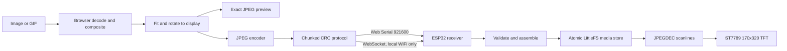

# Cyberclip architecture

## Responsibility boundary

Cyberclip has two deployable parts:

1. An HTTPS-hosted Vite PWA running in Chrome or Edge.
2. Firmware flashed to the ideaspark ESP32/ST7789 board.

The browser owns all user-facing and media-heavy behavior. The ESP32 is intentionally a small, defensive display endpoint.



## Browser modules

| Module | Responsibility |
|---|---|
| `src/app.js` | UI state, settings, progress, media orchestration, cancellation |
| `src/deviceApp.js` | Streamlined phone UI and same-origin AP WebSocket orchestration |
| `src/serial.js` | Web Serial permission, streams, requests, timeouts, disconnect recovery |
| `src/wifiTransport.js` | WebSocket lifecycle for the local-network WiFi transport, mirroring `serial.js`'s shape |
| `src/protocol.js` | Packet encoding, incremental response parsing, CRC, typed payloads |
| `src/images.js` | Fit modes, rotation dimensions, color canvas render, bounded JPEG encoding |
| `src/gifs.js` | GIF validation, frame compositing, disposal, source delays |

Only `serial.js` and `wifiTransport.js` own their respective transport's connection lifecycle, and each exposes the same `connect`/`request`/`disconnect`/`connected` shape so `app.js` can use either interchangeably. Only `protocol.js` knows the wire representation, which both transports carry unchanged. This keeps media processing transport-independent and prevents concurrent code paths from writing interleaved packets.

Both browser entries import the same `images.js`, `gifs.js`, `protocol.js`, and `wifiTransport.js` implementations. The phone therefore performs the same decode, compositing, fit, resize, JPEG-quality fallback, framing, and CRC operations as the desktop browser rather than relying on a second firmware implementation.

## Firmware modules

`firmware/matrix_display.ino` contains:

- an in-code LovyanGFX profile for the integrated ST7789;
- non-blocking byte-wise protocol parsers, one fed from USB serial and one from the WiFi transport (see below), each replying to its own connection;
- bounded compressed-frame transfer state;
- a two-pass JPEG validation/render path;
- dual-generation LittleFS persistence and firmware-side GIF scheduling;
- rotation, clear, status, backlight, and WiFi provisioning behavior.

`firmware/protocol.h` contains shared numeric definitions, little-endian helpers, and the CRC implementation. Its pure helpers are exercised by the PlatformIO native test.

`firmware/src/wifi_manager.h/.cpp` stores station credentials, the local pairing token, hotspot mode, last enabled hotspot mode, and WPA2 password in NVS (via `Preferences`). It owns the combined AP/station lifecycle. Hotspot modes are off, automatic fallback after station failure, and always on.

`firmware/src/ws_server.h/.cpp` runs the HTTP server and WebSocket endpoint (`ESPAsyncWebServer`/`AsyncWebSocket`). The WebSocket carries the same framed packets as USB serial and accepts one client at a time. Station-side clients must present the 16-byte pairing token. AP-side clients may use the hosted page's empty authorization preamble only when the server observes an AP-interface local address. Later bytes are queued and drained on the main loop task so protocol handling remains single-threaded.

The dedicated Vite device build is gzip-compressed and generated into a firmware header before an ESP32 build. HTTP serves those immutable assets from program flash only to AP-side clients. It does not use LittleFS, so the desktop firmware updater can replace the hosted page while preserving stored media.

## Protocol framing

All multi-byte values are little-endian.

```text
Offset  Size  Field
0       2     Magic bytes 0x43 0x43 ("CC")
2       1     Protocol version
3       1     Command
4       2     Sequence
6       4     Payload length
10      N     Payload
10+N    2     CRC-16/CCITT-FALSE
```

The CRC starts at the version byte and ends after the payload. Maximum wire payload is 4096 bytes.

### Request flow

1. `HELLO` verifies compatible firmware and reads display/transfer capabilities.
2. `BEGIN_FRAME` reserves a bounded JPEG buffer and records dimensions, rotation, and total length.
3. Consecutive `FRAME_CHUNK` requests carry transfer ID, exact offset, and up to 4090 data bytes.
4. `COMMIT_FRAME` requires the complete byte count, validates JPEG dimensions/decoding, and renders it.
5. Every mutating request receives a sequence-correlated `ACK` or typed `NACK`.

`CANCEL_TRANSFER` frees an incomplete buffer. `SET_BACKLIGHT`, `CLEAR_DISPLAY`, and `GET_STATUS` provide device controls and diagnostics.

`BEGIN_PLAYLIST` starts an inactive flash generation. Persistent `BEGIN_FRAME` requests identify frame index and delay; each committed JPEG is written to that generation. `END_PLAYLIST` validates the complete set and atomically switches metadata to the new generation. `PLAY_STORED` resumes it and `CLEAR_STORED` removes both generations.

## Failure behavior

- Invalid magic is skipped until the parser resynchronizes.
- Oversized payloads are rejected before allocation.
- Bad CRC, dimensions, offsets, transfer IDs, codecs, and commands produce explicit NACK codes.
- Partial packets time out and reset parser state.
- Partial frames never update the TFT.
- The previous valid image remains visible after transfer or JPEG failures.
- Browser request timeouts reject the active operation and trigger best-effort transfer cancellation.
- USB removal, or the WiFi connection dropping, rejects pending requests, cancels playback, releases stream/socket resources, and returns the UI to disconnected state - both transports report through the same `onStateChange`/`onProtocolError` shape.

## GIF pipeline

The browser composites each source GIF frame according to transparency and disposal rules, resizes it to the selected display rotation, JPEG-encodes it, transfers it, and waits for render acknowledgement. With persistence disabled, the browser schedules those frames directly. With persistence enabled, the firmware shows byte-level progress across the complete playlist while each frame is validated and stored without rendering it. After the inactive LittleFS generation is complete and atomically activated, the firmware renders the first frame and schedules playback.

The effective interval for each frame is:

```text
max(source or override delay, browser encode + USB transfer + ESP decode)
```

The UI reports when requested timing cannot be sustained. This bounds browser and ESP32 memory and avoids claiming playback speeds the hardware cannot deliver.

## PWA and privacy

The desktop service worker caches only same-origin static application assets. Selected media, serial/WebSocket packets, port/host details, and device responses are not cached. The only persisted browser values are presentation preferences and, once station WiFi is set up, the device's last-known local IP and pairing token. The hosted phone page stores only its presentation preferences.

Web Serial requires HTTPS or localhost and explicit user permission. LAN WiFi control requires the USB-issued random pairing token. The ESP32-hosted page uses HTTP on the isolated device hotspot; the WPA2 password protects network access, and tokenless WebSockets are accepted only on the AP interface. There is no cloud relay, external server, analytics, or background device access.
