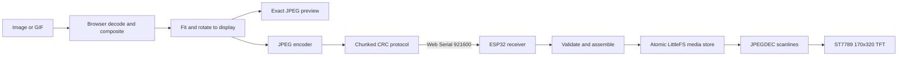

# Cyberclip architecture

## Responsibility boundary

Cyberclip has two deployable parts:

1. An HTTPS-hosted Vite PWA running in Chrome or Edge.
2. Firmware flashed to the ideaspark ESP32/ST7789 board.

The browser owns all user-facing and media-heavy behavior. The ESP32 is intentionally a small, defensive display endpoint.



## Browser modules

| Module | Responsibility |
|---|---|
| `src/app.js` | UI state, settings, progress, media orchestration, cancellation |
| `src/serial.js` | Web Serial permission, streams, requests, timeouts, disconnect recovery |
| `src/protocol.js` | Packet encoding, incremental response parsing, CRC, typed payloads |
| `src/images.js` | Fit modes, rotation dimensions, color canvas render, bounded JPEG encoding |
| `src/gifs.js` | GIF validation, frame compositing, disposal, source delays |

Only `serial.js` owns the browser serial streams. Only `protocol.js` knows the wire representation. This keeps media processing transport-independent and prevents concurrent code paths from writing interleaved packets.

## Firmware modules

`firmware/matrix_display.ino` contains:

- an in-code LovyanGFX profile for the integrated ST7789;
- a non-blocking byte-wise protocol parser;
- bounded compressed-frame transfer state;
- a two-pass JPEG validation/render path;
- dual-generation LittleFS persistence and firmware-side GIF scheduling;
- rotation, clear, status, and backlight behavior.

`firmware/protocol.h` contains shared numeric definitions, little-endian helpers, and the CRC implementation. Its pure helpers are exercised by the PlatformIO native test.

## Protocol framing

All multi-byte values are little-endian.

```text
Offset  Size  Field
0       2     Magic bytes 0x43 0x43 ("CC")
2       1     Protocol version
3       1     Command
4       2     Sequence
6       4     Payload length
10      N     Payload
10+N    2     CRC-16/CCITT-FALSE
```

The CRC starts at the version byte and ends after the payload. Maximum wire payload is 4096 bytes.

### Request flow

1. `HELLO` verifies compatible firmware and reads display/transfer capabilities.
2. `BEGIN_FRAME` reserves a bounded JPEG buffer and records dimensions, rotation, and total length.
3. Consecutive `FRAME_CHUNK` requests carry transfer ID, exact offset, and up to 4090 data bytes.
4. `COMMIT_FRAME` requires the complete byte count, validates JPEG dimensions/decoding, and renders it.
5. Every mutating request receives a sequence-correlated `ACK` or typed `NACK`.

`CANCEL_TRANSFER` frees an incomplete buffer. `SET_BACKLIGHT`, `CLEAR_DISPLAY`, and `GET_STATUS` provide device controls and diagnostics.

`BEGIN_PLAYLIST` starts an inactive flash generation. Persistent `BEGIN_FRAME` requests identify frame index and delay; each committed JPEG is written to that generation. `END_PLAYLIST` validates the complete set and atomically switches metadata to the new generation. `PLAY_STORED` resumes it and `CLEAR_STORED` removes both generations.

## Failure behavior

- Invalid magic is skipped until the parser resynchronizes.
- Oversized payloads are rejected before allocation.
- Bad CRC, dimensions, offsets, transfer IDs, codecs, and commands produce explicit NACK codes.
- Partial packets time out and reset parser state.
- Partial frames never update the TFT.
- The previous valid image remains visible after transfer or JPEG failures.
- Browser request timeouts reject the active operation and trigger best-effort transfer cancellation.
- USB removal rejects pending requests, cancels playback, releases stream locks, and returns the UI to disconnected state.

## GIF pipeline

The browser composites each source GIF frame according to transparency and disposal rules, resizes it to the selected display rotation, JPEG-encodes it, transfers it, and waits for render acknowledgement. With persistence disabled, the browser schedules those frames directly. With persistence enabled, it uploads each frame once and the firmware schedules playback from LittleFS.

The effective interval for each frame is:

```text
max(source or override delay, browser encode + USB transfer + ESP decode)
```

The UI reports when requested timing cannot be sustained. This bounds browser and ESP32 memory and avoids claiming playback speeds the hardware cannot deliver.

## PWA and privacy

The service worker caches only same-origin static application assets. Selected media, serial packets, port details, and device responses are not cached. The only persisted values are presentation preferences such as fit, rotation, quality, backlight, GIF delay, and loop choice.

Web Serial requires HTTPS or localhost and explicit user permission. The architecture has no server-side upload path, analytics, cloud relay, or background device access.
